# Moovy: Movie Explorer Platform  

**Smarter ways to search, save, and watch.**  
A personal project built to explore movie discovery, recommendation, and user interaction.  

---

## Motivation  

I often found myself wanting to discover movies that match how I feel on a given day, not just by genre or popularity. Existing platforms mostly recommend by category (e.g., action, comedy, popular now) but rarely capture mood or context.  

This project, **Moovy**, was created to solve that problem. It combines traditional movie discovery with emotion-based recommendations, allowing users to search, save, and engage with movies in a more personal way.  

Key motivations:  
- Build an emotion- and context-based curation system  
- Integrate AI to provide empathetic, natural recommendations  
- Practice full-stack development (frontend, backend, database, deployment)  
- Explore OAuth authentication and third-party API integration  

---

## Features  

- **Movie Search** – Search movies in real time using the TMDB API  
- **Movie Details** – View details such as synopsis, cast, trailers, and images  
- **Authentication**  
  - Local sign-up and login (JWT-based)  
  - Google OAuth 2.0 login  
- **Comments and Replies**  
  - Post, edit, and delete comments and replies  
  - Like system for comments  
- **Watchlist**  
  - Save and manage movies by user account  
- **Emotion-Based Recommendations ("Emotion Cube")**  
  - Uses OpenAI API and TMDB Discover endpoint  
  - Recommends movies based on moods or contexts (e.g., "lonely night," "stressful Monday")  

---

## Tech Stack  

- **Frontend**: HTML, CSS, JavaScript  
- **Backend**: Node.js (Express)  
- **Database**: MySQL (hosted on Railway)  
- **APIs**:  
  - TMDB  
  - OpenAI GPT  
  - Google OAuth  
- **Deployment**: Railway  

---


## Project Demo  

Here are example screenshots of the platform in action:  

- **Home Page**  
  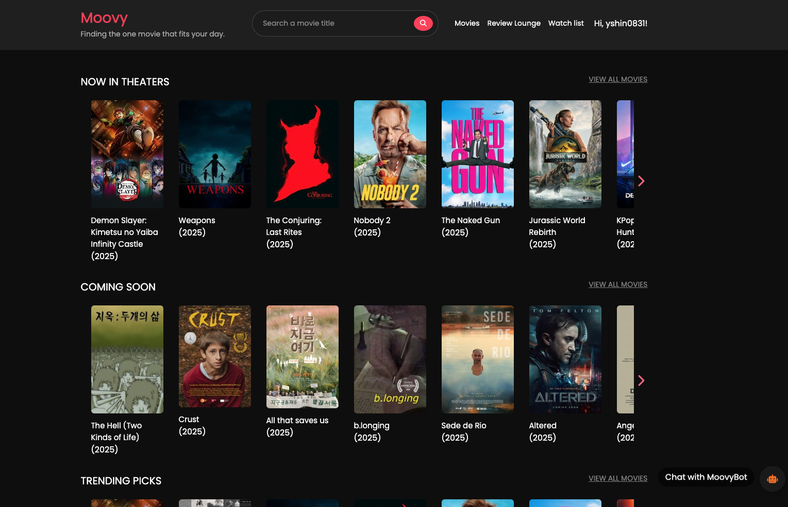  
  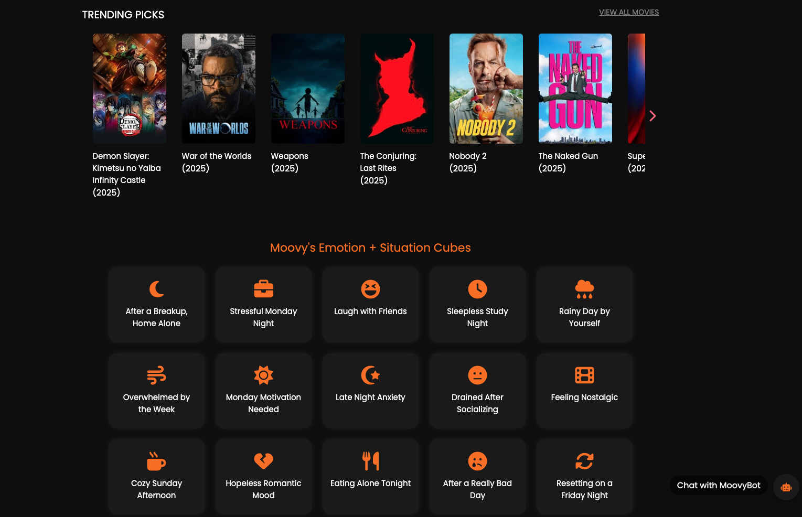  

- **Chatbot**  
  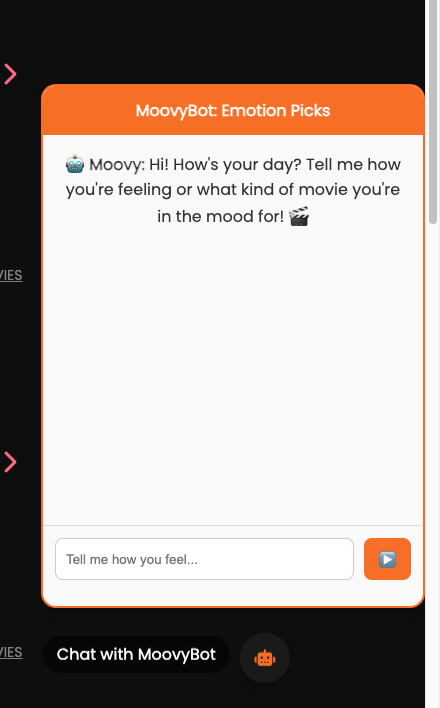  
  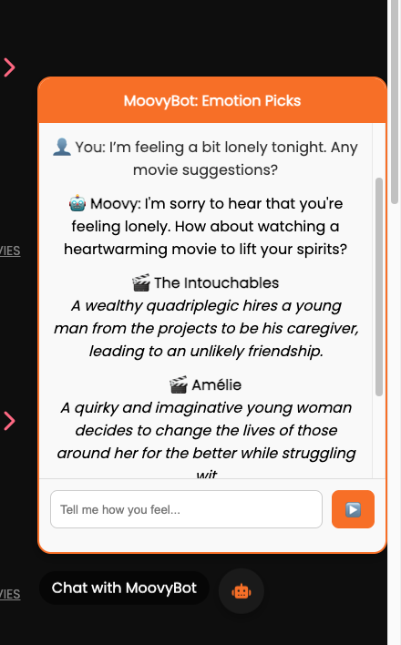  

- **Movie Details**  
  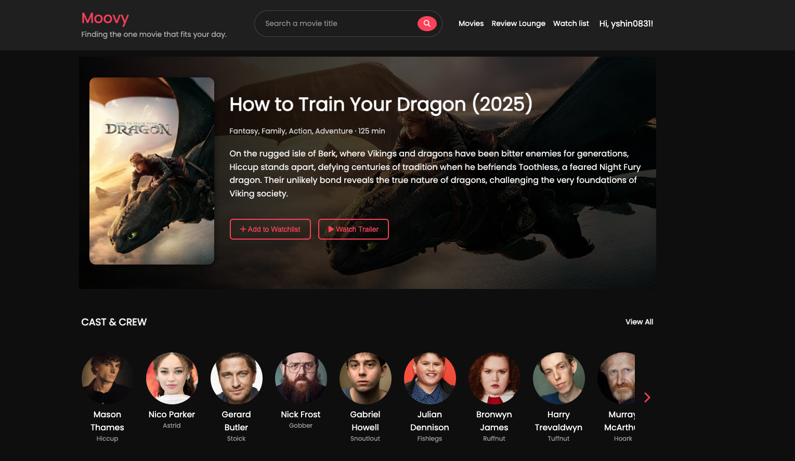  
  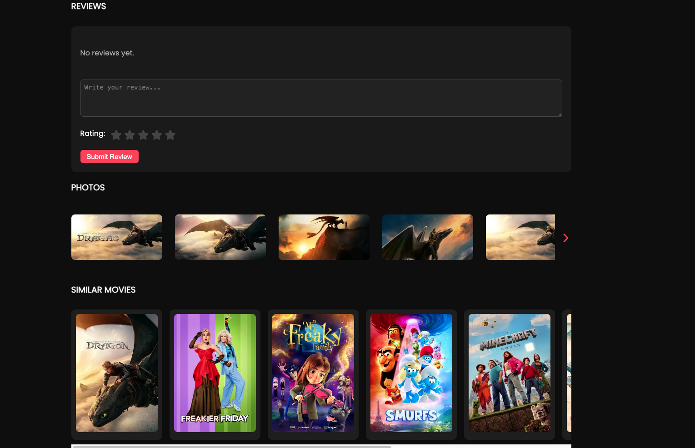  

- **Comments and Replies**  
  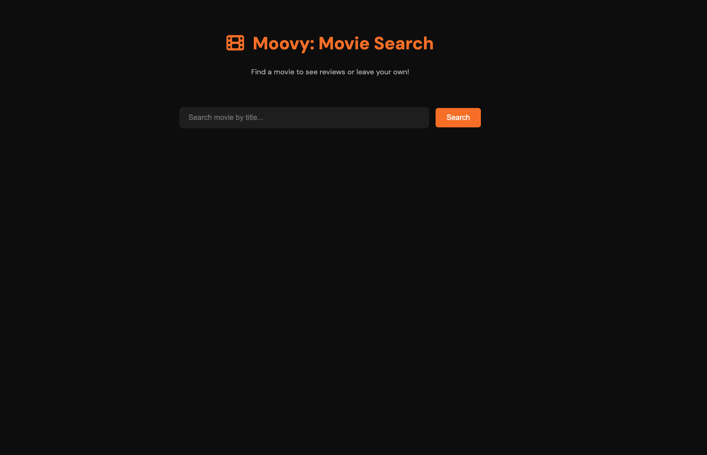  
  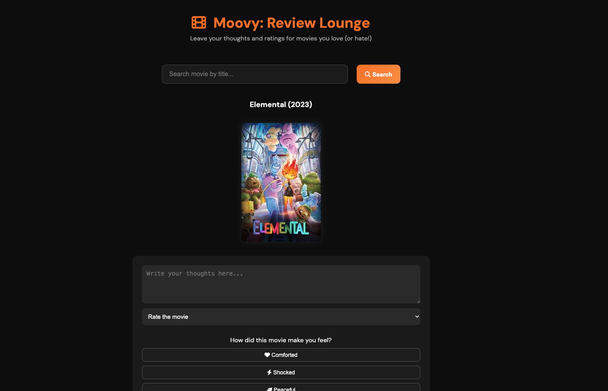  
  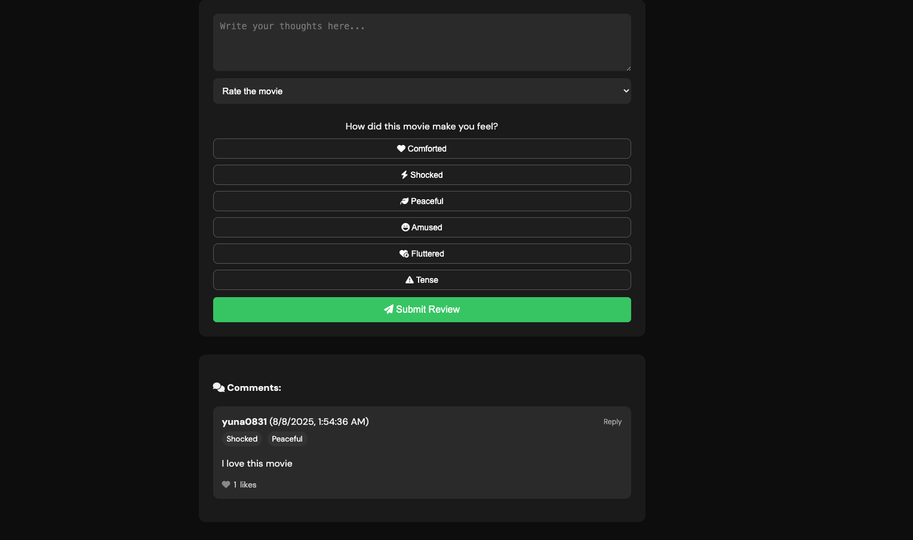  

- **Emotion Cube**  
  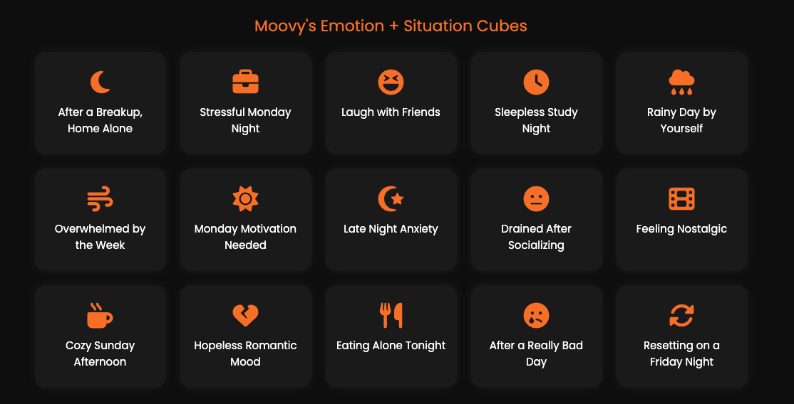  
  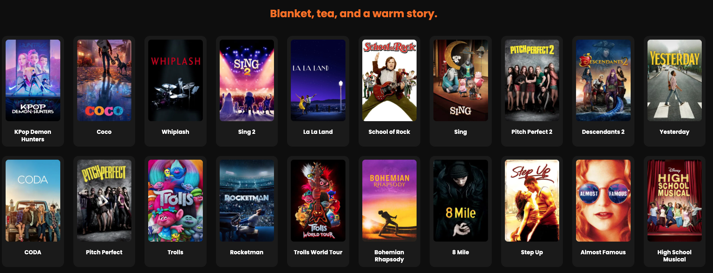  

- **Watch List**  
  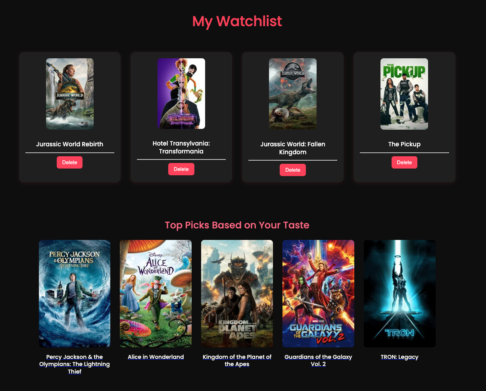  

- **Log in**  
  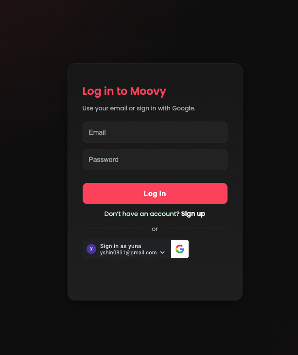  
  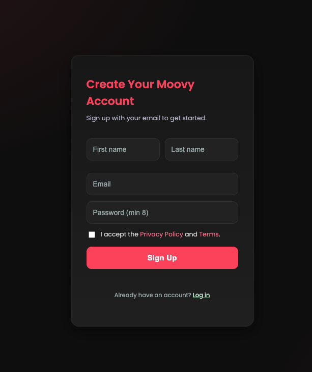  


## Setup  

### 1. Clone the repository
```bash
git clone https://github.com/yuna0831/movie-explorer-platform.git
cd movie-explorer-platform